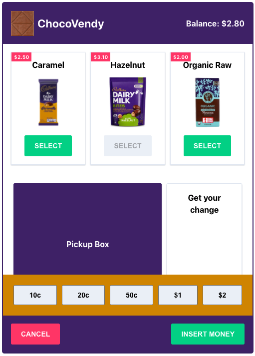
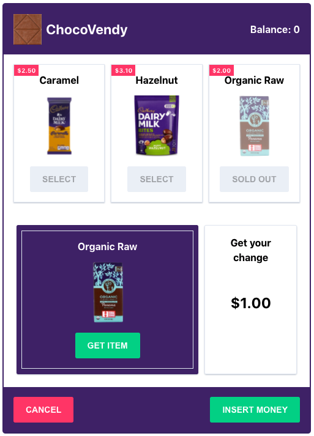

# Chocolate Vending Machine

## Requirments


## Getting Started

Open your terminal and start the app. You might need to reload the page if the API runs after the client.

```bash
yarn start:all
```

## Demo

<p align="center">
    <video width="90%" controls>
        <source src="./demo/chocolate-vending-machine-demo.mov" type="video/mov">
        Your browser does not support HTML video.
    </video>
</p>

## Screenshots

<p align="center">
    
    
</p>
