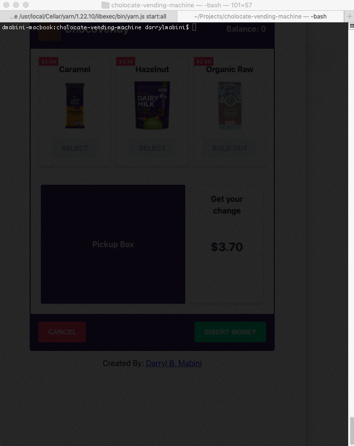

# ChocoVendy

## Requirments


Port `3000` and `4000` availability.

## Getting Started

Install dependencies

```bash
yarn install
```

Open your terminal and start the app. You might need to reload the page if the API runs after the client.

```bash
yarn start:all
```

## Docs

- [API](packages/api)
- [Client](packages/api)

## Demo

<p align="center">
    
    
</p>

## Screenshots

<p align="center">
    
    
</p>
