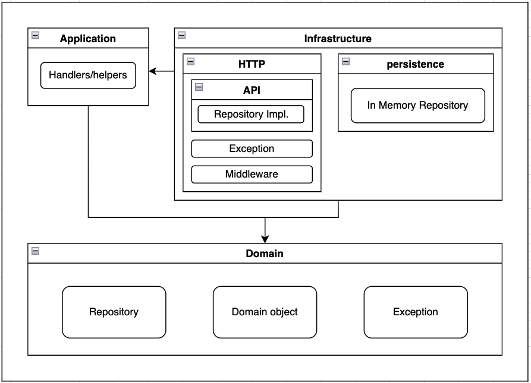

# Chocolate Vending Machine API

## Prerequisite

Port `4000` availability. If not available please modify `APP_PORT` in `.env`.

## Requirments


## Getting Started

### .env file

```console
cp .env.default .env
```

### Install dependencies

```console
yarn install
```

### Test

```console
yarn test
```

### Linter

```console
yarn test
```

### Start

```console
yarn start
```

### REST API

`/api/products`

```terminal
curl --location --request GET 'http://localhost:4000/api/products'
```

`/api/product/:id`

```terminal
curl --location --request POST 'http://localhost:4000/api/product/2' \
--header 'Content-Type: application/json' \
--data-raw '{
    "id": 2,
    "name": "Hazelnut",
    "quantity": 2
}'
```

## Folder Structure

```
src/
├── application
│   └── handler
├── config
├── domain
│   ├── exception
│   └── product
├── infrastructure
│   ├── http
│   │   ├── api
│   │   ├── exception
│   │   └── middleware
│   └── persistence
├── tests
├── index.ts
├── server.ts
└── types.ts
```

## Architechture Diagram

<p align="center">
  
</p>

## Future Improvements

Use [Swagger](https://swagger.io/) for better API documentation
